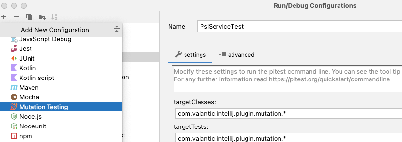
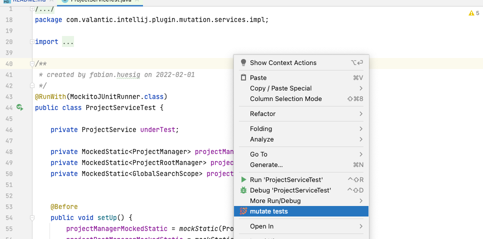
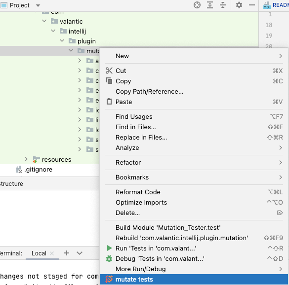
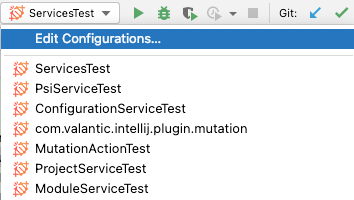
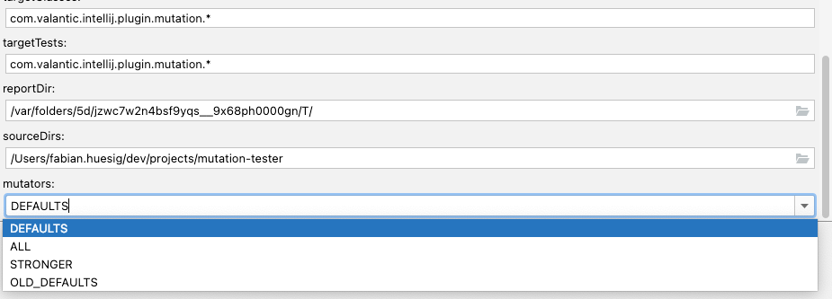
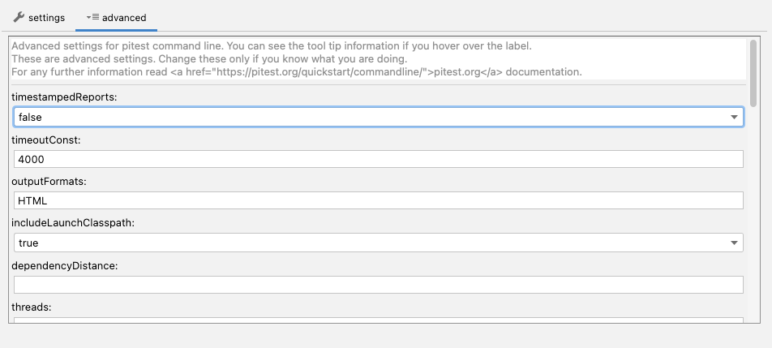

# Mutation Tester
This Plugin enables mutation testing in your IDE based on <a href="https://pitest.org">pitest.org</a>.


[](LICENSE.md)
[](http://hits.dwyl.com/valantic/mutation-tester)
[](https://htmlpreview.github.io/?https://github.com/valantic/mutation-tester/blob/main/samples/pitreport-v.1.0.0/index.html)
[](https://sonarcloud.io/summary/new_code?id=valantic_mutation-tester)
[](https://sonarcloud.io/summary/new_code?id=valantic_mutation-tester)
[](https://sonarcloud.io/summary/new_code?id=valantic_mutation-tester)
[](https://sonarcloud.io/summary/new_code?id=valantic_mutation-tester)
[](https://sonarcloud.io/summary/new_code?id=valantic_mutation-tester)
[](https://sonarcloud.io/summary/new_code?id=valantic_mutation-tester)
[](https://sonarcloud.io/summary/new_code?id=valantic_mutation-tester)
[](https://sonarcloud.io/summary/new_code?id=valantic_mutation-tester)
[](https://sonarcloud.io/summary/new_code?id=valantic_mutation-tester)

This package is developed by [valantic CEC Schweiz](https://www.valantic.com/).


## About
Mutation Testing is also called Fault-based testing strategy as it involves creating a fault in the program and it is a type of White Box Testing which is mainly used for Unit Testing.
When the application code changes, it should produce different results and cause the unit tests to fail. If a unit test does not fail in this situation, it may indicate an issue with the test suite.

This kind of testing helps you to produce better testing results, not only based on line coverage but also on mutation coverage. If less of your code can mutate, you can be sure to have a higher code quality.

This Plugin will help you as developer to run mutation tests easy and fast in your IDE without wasting time in configurations.

For example is a full Pit Mutation Testing report of this plugin <a href="https://htmlpreview.github.io/?https://github.com/valantic/mutation-tester/blob/main/samples/pitreport-v.1.0.0/index.html">here</a>

#### Versions
| Tool          | Supported / Used Version |
|---------------|--------------------------|
| PIT           | 1.9.0                    |
| IntelliJ Idea | 2020.3.4 - now           |


## Installation
You can download the plugin from our [github](https://github.com/valantic/mutation-tester).
Next open your IntelliJ and install the plugin from disk, as seen below.
It is recommended to restart your IDE.


### IntelliJ Marketplace
The Plugin will be published to the Intellij Marketplace. This should be available in the store after our beta testing.
Publishing should be within end of 07.2022.

Update: Plugin is in IntelliJ Marketplace. You can download it [here](https://plugins.jetbrains.com/plugin/19453-mutation-tester)

## Run the plugin
You can simply create a new RunConfigurations with Mutation Tester


This Plugin will save you a lot of time. You don't need to create everytime new configurations by hand to test your new unit test. 
With this tool you can automatically create configuration for your given test, as seen below by just executing the test in the run context of the unit test.




You can also select packages in your test directory and test all classes in this package with all the tests in same named package.



If you still need to adjust the configuration you can do this easily. Each run will create a RunConfiguration you can simply modify.




## Configuration
If you need to adjust the defualt configuration, you can just go into your RunConfiguration and adjust the default settings.




In the tab settings the values of targetTests, targetClasses, reportDir, sourceDirs and mutators can not be empty. Otherwise the tests will not run. in the advanced tab you can easily modify default behaviour.




You can get more informations about the configuration fields [here](https://pitest.org/quickstart/commandline/).

## Limitations
This Plugin has a few limitation, we might (if needed) will fix in the near future.

```
automaticly determine name of to be testet Class

When executing the plugin from the context-menu oder inside a class, the targetTest and targetClass 
will be set automaticly. This is handled by default naming conventions. For example, you test the 
Class "SampleService" with the test "SampleServiceTest", there will no problem setting these values 
automaticly. The plugin will you the targetTest "SampleServiceTest" and remove the suffix "Test", 
and will check if the rest of the string "SampleService" is a valid class.
If it doesn't, the targetTestClass will be set by the package the test class "SampleServiceTest" is in. 
You can always update the correct names by hand. If you might have different namingConventions relating 
the application and testclass let us know, so we can add it to the automated process.
```

## Copyright and Licensing Information
See [LICENSE.md](LICENSE.md) for the complete License.

Copyright [2022] [valantic CEC Schweiz AG]

Licensed under the Apache License, Version 2.0 (the "License");
you may not use this file except in compliance with the License.
You may obtain a copy of the License at

```
http://www.apache.org/licenses/LICENSE-2.0
```

Unless required by applicable law or agreed to in writing, software
distributed under the License is distributed on an "AS IS" BASIS,
WITHOUT WARRANTIES OR CONDITIONS OF ANY KIND, either express or implied.
See the License for the specific language governing permissions and
limitations under the License.


## Contact Information
For any issue with plugin please use the our <a href="https://github.com/valantic/mutation-tester/issues">issueboard on github</a>.

For any information about our company go to <a href="https://valantic.com">valantic.com</a>.


## Credit and Acknowledgments
This Plugin is based on the commandline tools from <a href="https://pitest.org/">pitest.org</a>.
So special credits go out to henry@pitest.org for developing such an amazing tool.

Also the Icon (mutation.png) is based on an icon from flaticon by Freepik.
<a href="https://www.flaticon.com/de/kostenlose-icons/gen" title="gen Icons">Gen Icons erstellt von Freepik - Flaticon</a>

## Change Notes
- <b>0.1.0</b> - 2022-02: Published Beta Version with primary focused on SAP Commerce
- <b>0.1.1</b> - 2022-02: Raised Testcoverage. Fixed issue with missing module on run configuration
- <b>0.1.2</b> - 2022-02: Setting up Sonarcube and refactoring classes
- <b>0.1.3</b> - 2022-06: Enabled support for 2022.1. Include libs into jar for NoClassDefException. Updated Pitest to 1.9.0. Updated info.solidsoft.pitest to 1.7.4. Updated org.jetbrains.intellij to 1.6.0. Fixed Bug with JacocoTestReports
- <b>end of beta</b>
- <b>1.0.0</b> - 2022-07: Updated Unittests. Enabled Upload to Marketplace. Fixed Bug with NoModuleDefinied Error.
- <b>1.1.0</b> - 2022-07: Enables untilBuild to the newest. Enabled Support for IntelliJ IDE since 2020.3.4

## Roadmap
- [x] fix beta issues
- [x] add to IntelliJ Marketplace
- [ ] cross module testing
- [ ] caching
